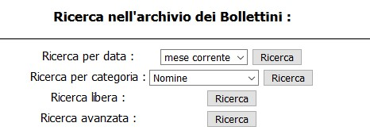

# Dettaglio risultati: conformità WCAG 2.1 livello A

<br>
[[Salta indice](#1-percepibile)]

## Indice

[TOC]

## 1. Percepibile

Le informazioni e i componenti dell'interfaccia utente devono essere presentati agli utenti in modi in cui essi possano percepirli.

### Linea guida 1.1 Alternative testuali

Fornire alternative testuali per qualsiasi contenuto non di testo in modo che questo possa essere trasformato in altre forme fruibili secondo le necessità degli utenti come stampa a caratteri ingranditi, Braille, sintesi vocale, simboli o un linguaggio più semplice.


<div class="success-criteria success-criteria-danger">
     <h4>Criterio di successo 1.1.1 Contenuti non testuali</h4>

     <p>Tutti i contenuti non testuali presentati all'utente hanno un'alternativa testuale equivalente che serve allo stesso scopo, ad eccezione dei seguenti casi: controlli, input, media temporizzati, test, esperienze sensoriali, CAPTCHA, decorazioni, formattazioni, contenuti invisibili.</p>
     <br>
     <p><strong>Esito: NEGATIVO</strong></p>
</div>

<br/>

<strong>SINTOMO</strong>  
Utenti che usano tecnologie assistive per la navigazione della pagina potrebbero non essere in grado di interpretare i vari form di ricerca "Archivio dei Bollettini".
<div class="nice-border">

</div>

<strong>CAUSA</strong>  
Nella pagina "Bollettino Stampa" i form sono impaginati tramite una tabella. Visivamente si capisce che questi sono form diversi grazie all'impaginazione, ma sematicamente non c'è alcun legame tra etichette ed input.

<strong>POSSIBILE SOLUZIONE</strong>  
Utilizzare delle etichette per identificare gli input e il loro scopo.  
Esempio:  

```html
<form>
    <label for="select">Ricerca per data:</label>
    <select type="select" name="select">
        <option value="/content/salastampa/it/bollettino/pubblico/2019/07.html">mese corrente</option>
        <option value="/content/salastampa/it/bollettino/pubblico/2019.html">2019</option>
        <option value="/content/salastampa/it/bollettino/pubblico/2019.html">2018</option>
        ...
    </select>
    <input type="button" value="Ricerca" onclick="document.location.href = jQuery('#time').val();">
</form>
```

### Linea guida 1.2 Media temporizzati

Fornire alternative per i media temporizzati.

<div class="success-criteria success-criteria-warning">
     <h4>Criterio di successo 1.2.1 Solo audio e solo video (preregistrati)</h4>

     <p>Per i tipi di media preregistrati di solo audio e di solo video, a meno che questi non costituiscano un tipo di media alternativo ad un contenuto testuale chiaramente etichettato come tale, sono soddisfatti i seguenti punti: solo audio preregistrato, solo video preregistrato.</p>
     <br>
     <p><strong>Esito: NON VALUTABILE</strong></p>
</div>

<div class="success-criteria success-criteria-warning">
     <h4>Criterio di successo 1.2.2 Sottotitoli (preregistrati)</h4>

     <p>Per tutti i contenuti audio preregistrati presenti in tipi di media sincronizzati sono forniti sottotitoli, eccetto quando tali contenuti sono alternativi ad un contenuto testuale e sono chiaramente etichettati come tali.</p>
     <br>
     <p><strong>Esito: NON VALUTABILE</strong></p>
</div>

<div class="success-criteria success-criteria-warning">
     <h4>Criterio di successo 1.2.3 Audiodescrizione o tipo di media alternativo (preregistrato)</h4>

     <p>Per i media sincronizzati è fornita un'alternativa ai media temporizzati, oppure una audiodescrizione dei contenuti video preregistrati, eccetto quando il contenuto audio o video è alternativo ad un contenuto testuale ed è chiaramente etichettato come tale.</p>
     <br>
     <p><strong>Esito: NON VALUTABILE</strong></p>
</div>

### Linea guida 1.3 Adattabile

Creare contenuti che possano essere rappresentati in modalità differenti (ad esempio, con layout più semplici), senza perdere informazioni o struttura.


<div class="success-criteria success-criteria-danger">
     <h4>Criterio di successo 1.3.1 Informazioni e correlazioni</h4>

     <p>Le informazioni, la struttura e le correlazioni trasmesse dalla presentazione possono essere determinate programmaticamente oppure sono disponibili tramite testo.</p>
     <br>
     <p><strong>Esito: NEGATIVO</strong></p>
</div>

<br/>

<strong>SINTOMO</strong>  
Nella pagina "Bollettino Stampa" la navigazione può risultare difficile per chi utilizza la tastiera e i lettori di schermo.

<strong>CAUSA</strong>  
I livelli di heading non vengono rispettati. Non è presente un ```<h1>``` all'interno del documento, solo una intestazione di livello 3 ```<h3>```.

<strong>POSSIBILE SOLUZIONE</strong>  
Impostare una struttura corretta per le intestazioni.

<div class="success-criteria success-criteria-danger">
     <h4>Criterio di successo 1.3.2 Sequenza significativa</h4>

     <p>Quando la sequenza in cui il contenuto è presentato influisce sul suo significato, la corretta sequenza di lettura può essere determinata programmaticamente.</p>
     <br>
     <p><strong>Esito: NEGATIVO</strong></p>
</div>

<br/>

<strong>SINTOMO</strong>  
Nella pagina "Bollettino Stampa" la navigazione può risultare difficile per chi utilizza la tastiera e i lettori di schermo.

<strong>CAUSA</strong>  
Sia navigando da tastiera che utilizzando il lettore di schermo non è possibile leggere le "etichette" dei vari form di ricerca.

<strong>POSSIBILE SOLUZIONE</strong>  
Eliminare il layout a tabella e utilizzare correttamente ```<label>``` per i form.

<div class="success-criteria success-criteria-success">
     <h4>Criterio di successo 1.3.3 Caratteristiche sensoriali</h4>
     <p>Le istruzioni fornite per comprendere ed operare sui contenuti non si basano unicamente su caratteristiche sensoriali dei componenti quali forma, colore, dimensione, ubicazione visiva, orientamento o suono.</p>
     <br>
     <p><strong>Esito: POSITIVO</strong></p>
</div>

### Linea guida 1.4 Distinguibile

Rendere più semplice agli utenti la visione e l'ascolto dei contenuti, separando i contenuti in primo piano dallo sfondo.

<div class="success-criteria success-criteria-success">
     <h4>Criterio di successo 1.4.1 Uso del colore</h4>
     <p>Il colore non deve essere utilizzato come unica modalità visiva per rappresentare informazioni, indicare azioni, richiedere risposte o come elemento di distinzione visiva.</p>
     <br>
     <p><strong>Esito: POSITIVO</strong></p>
</div>

<div class="success-criteria success-criteria-warning">
     <h4>Criterio di successo 1.4.2 Controllo del sonoro</h4>
     <p>Se un contenuto audio all'interno di una pagina Web è eseguito automaticamente per più di tre secondi o si fornisce una funzionalità per metterlo in pausa o interromperlo, oppure si fornisce una modalità per il controllo dell'audio che sia indipendente dal controllo predefinito del sistema.</p>
     <br>
     <p><strong>Esito: NON VALUTABILE</strong></p>
</div>

## 2. Utilizzabile

I componenti e la navigazione dell'interfaccia utente devono essere utilizzabili.

### Linea guida 2.1 Accessibile da tastiera

Rendere disponibili tutte le funzionalità tramite tastiera.

<div class="success-criteria success-criteria-success">
     <h4>Criterio di successo 2.1.1 Tastiera</h4>
     <p>Tutte le funzionalità del contenuto sono utilizzabili tramite un'interfaccia di tastiera senza richiedere tempi specifici per la pressione dei singoli tasti, salvo il caso in cui sia la funzionalità di fondo a richiedere un input che dipende dal percorso del movimento dell'utente e non solo dai suoi punti d'arrivo.</p>
     <br>
     <p><strong>Esito: POSITIVO</strong></p>
</div>

<div class="success-criteria success-criteria-success">
     <h4>Criterio di successo 2.1.2 Nessun impedimento all'uso della tastiera</h4>
     <p>Se il focus di tastiera può essere spostato tramite una interfaccia di tastiera su un componente della pagina, deve anche poter essere tolto dallo stesso componente usando solo la stessa interfaccia e, se a tal fine non fosse sufficiente l'uso dei normali tasti freccia o tab o l'uso di altri metodi di uscita standard, l'utente deve essere informato sul metodo per spostare il focus.</p>
     <br>
     <p><strong>Esito: POSITIVO</strong></p>
</div>

<div class="success-criteria success-criteria-warning">
     <h4>Criterio di successo 2.1.4 Tasti di scelta rapida</h4>
     <p>Se nel contenuto viene implementata una scorciatoia da tastiera utilizzando sole lettere (maiuscole e minuscole), segni di punteggiatura, numeri o simboli, allora è vera almeno una delle seguenti condizioni: disattivazione, rimappatura, attivazione solo al focus.</p>
     <br>
     <p><strong>Esito: NON VALUTABILE</strong></p>
</div>


### Linea guida 2.2 Adeguata disponibilità di tempo

Fornire agli utenti tempo sufficiente per leggere e utilizzare i contenuti.


<div class="success-criteria success-criteria-warning">
     <h4>Criterio di successo 2.2.1 Regolazione tempi di esecuzione</h4>
     <p>Per ogni temporizzazione presente nel contenuto, è soddisfatto almeno uno dei seguenti casi: spegnimento, regolazione, estensione, eccezione per eventi in tempo reale, eccezione di essenzialità, eccezione delle 20 ore.</p>
     <br>
     <p><strong>Esito: NON VALUTABILE</strong></p>
</div>

<div class="success-criteria success-criteria-warning">
     <h4>Criterio di successo 2.2.2 Pausa, stop, nascondi</h4>
     <p>Nei casi di animazioni, lampeggiamenti, scorrimenti o auto-aggiornamenti di informazioni, sono soddisfatti tutti i seguenti punti: spostamento, lampeggiamento, scorrimento, auto-aggiornamento.</p>
     <br>
     <p><strong>Esito: NON VALUTABILE</strong></p>
</div>


### Linea guida 2.3 Convulsioni e reazioni fisiche

Non sviluppare contenuti con tecniche che sia noto causino attacchi epilettici o reazioni fisiche.


<div class="success-criteria success-criteria-success">
     <h4>Criterio di successo 2.3.1 Tre lampeggiamenti o inferiore alla soglia</h4>
     <p>Le pagine Web non contengono nulla che lampeggi per più di tre volte in un secondo oppure il lampeggiamento è al di sotto della soglia generale di lampeggiamento e della soglia del lampeggiamento rosso.</p>
     <br>
     <p><strong>Esito: POSITIVO</strong></p>
</div>


### Linea guida 2.4 Navigabile

Fornire delle funzionalità di supporto all'utente per navigare, trovare contenuti e determinare la propria posizione.


<div class="success-criteria success-criteria-danger">
     <h4>Criterio di successo 2.4.1 Salto di blocchi</h4>
     <p>È disponibile un meccanismo per saltare i blocchi di contenuto che si ripetono su più pagine Web.</p>
     <br>
     <p><strong>Esito: NEGATIVO</strong></p>
</div>

<br/>

<strong>SINTOMO</strong>  
Persone con disabilità fanno fatica a raggiungere il contenuto principale velocemente e facilmente.

<strong>CAUSA</strong>  
Il sito è privo di link diretti al contenuto principale.

<strong>POSSIBILE SOLUZIONE</strong>  
Aggiungere un link all'inizio della pagina per arrivare al contenuto principale.

<div class="success-criteria success-criteria-success">
     <h4>Criterio di successo 2.4.2 Titolazione della pagina</h4>
     <p>Le pagine Web hanno titoli che ne descrivono l'argomento o la finalità.</p>
     <br>
     <p><strong>Esito: POSITIVO</strong></p>
</div>

<div class="success-criteria success-criteria-success">
     <h4>Criterio di successo 2.4.3 Ordine del focus</h4>
     <p>Se una pagina Web può essere navigata in modo sequenziale e le sequenze di navigazione influiscono sul suo significato e sul suo funzionamento, gli oggetti che possono ricevere il focus lo ricevono in un ordine che ne conserva il senso e l'operatività.</p>
     <br>
     <p><strong>Esito: POSITIVO</strong></p>
</div>

<div class="success-criteria success-criteria-success">
     <h4>Criterio di successo 2.4.4 Scopo del collegamento (nel contesto)</h4>
     <p>Lo scopo di ogni collegamento può essere determinato dal solo testo del collegamento oppure dal testo del collegamento insieme a dei contenuti contestuali che possono essere determinati programmaticamente, salvo il caso in cui lo scopo del collegamento potrebbe risultare ambiguo per la gli utenti in generale.</p>
     <br>
     <p><strong>Esito: POSITIVO</strong></p>
</div>


### Linea guida 2.5 Modalità di input

Rendere più facile agli utenti l'utilizzo di funzionalità attraverso input diversi dalla tastiera.


<div class="success-criteria success-criteria-success">
     <h4>Criterio di successo 2.5.1 Movimenti del puntatore</h4>
     <p>Tutte le funzionalità che per il loro utilizzo richiedono gesti multi punto o basati su percorsi possono essere gestite con un puntatore singolo senza gesti basati sul percorso, a meno che questi non siano essenziali.</p>
     <br>
     <p><strong>Esito: POSITIVO</strong></p>
</div>

<div class="success-criteria success-criteria-warning">
     <h4>Criterio di successo 2.5.2 Cancellazione delle azioni del puntatore</h4>
     <p>Per le funzionalità che possono essere gestite utilizzando un singolo puntatore, si verifica almeno una delle seguenti condizioni: nessun evento di selezione (down-event), interruzione o annullamento, inversione, essenziale.</p>
     <br>
     <p><strong>Esito: NON VALUTABILE</strong></p>
</div>

<div class="success-criteria success-criteria-warning">
     <h4>Criterio di successo 2.5.3 Etichetta nel nome</h4>
     <p>Per i componenti dell'interfaccia utente con etichette che includono testo o immagini di testo, il nome contiene il testo che viene presentato visivamente.</p>
     <br>
     <p><strong>Esito: NON VALUTABILE</strong></p>
</div>

<div class="success-criteria success-criteria-warning">
     <h4>Criterio di successo 2.5.4 Azionamento da movimento</h4>
     <p>Le funzionalità che possono essere azionate dal movimento del dispositivo o dell'utente possono anche essere attivate dai componenti dell'interfaccia utente e la risposta al movimento può essere disabilitata per impedire l'attivazione accidentale, tranne quando: interfaccia supportata, essenziale.</p>
     <br>
     <p><strong>Esito: NON VALUTABILE</strong></p>
</div>


## 3. Comprensibile

Le informazioni e le operazioni dell'interfaccia utente devono essere comprensibili.


### Linea guida 3.1 Leggibile

Rendere il testo leggibile e comprensibile.

<div class="success-criteria success-criteria-danger">
     <h4>Criterio di successo 3.1.1 Lingua della pagina</h4>
     <p>L'impostazione della lingua predefinita di ogni pagina Web può essere determinata programmaticamente.</p>
     <br>
     <p><strong>Esito: NEGATIVO</strong></p>
</div>

<br/>

<strong>SINTOMO</strong>  
Tecnologie assistive come un lettore di schermo non capiscono in quale lingua è stato scritto il documento.

<strong>CAUSA</strong>  
Assenza di un attributo ```lang```.

<strong>POSSIBILE SOLUZIONE</strong>  
Aggiungere un attributo ```lang``` al tag ```<html>```.
```html
<html lang="it">
```

### Linea guida 3.2 Prevedibile

Creare pagine Web che abbiano aspetto e funzionamento prevedibili.

<div class="success-criteria success-criteria-success">
     <h4>Criterio di successo 3.2.1 Al focus</h4>
     <p>Quando qualsiasi componente dell'interfaccia utente riceve il focus, non avvia un cambiamento del contesto.</p>
     <br>
     <p><strong>Esito: POSITIVO</strong></p>
</div>

<div class="success-criteria">
     <h4>Criterio di successo 3.2.2 All'input</h4>
     <p>Cambiare l'impostazione di qualsiasi componente nell'interfaccia utente non provoca automaticamente un cambiamento di contesto, a meno che l'utente sia stato informato del comportamento prima di utilizzare il componente.</p>
</div>


### Linea guida 3.3 Assistenza nell'inserimento

Aiutare gli utenti a evitare gli errori e agevolarli nella loro correzione.


<div class="success-criteria">
     <h4>Criterio di successo 3.3.1 Identificazione di errori</h4>
     <p>Se viene rilevato automaticamente un errore di inserimento, l'elemento in errore viene identificato e l'errore descritto tramite testo.</p>
</div>

<div class="success-criteria">
     <h4>Criterio di successo 3.3.2 Etichette o istruzioni</h4>
     <p>Sono fornite etichette o istruzioni quando il contenuto richiede azioni di input da parte dell'utente.</p>
</div>


## 4. Robusto

Il contenuto deve essere abbastanza robusto per essere interpretato in maniera affidabile da una grande varietà di programmi utente, comprese le tecnologie assistive.


### Linea guida 4.1 Compatibile

Garantire la massima compatibilità con i programmi utente attuali e futuri, comprese le tecnologie assistive.


<div class="success-criteria success-criteria-success">
     <h4>Criterio di successo 4.1.1 Analisi sintattica (parsing)</h4>
     <p>Nel contenuto implementato utilizzando linguaggi di marcatura gli elementi possiedono tag di apertura e chiusura completi, sono annidati in conformità alle proprie specifiche, non contengono attributi duplicati e tutti gli ID sono univoci, salvo i casi in cui le specifiche permettano eccezioni.</p>
     <br>
     <p><strong>Esito: POSITIVO</strong></p>
</div>

<div class="success-criteria">
     <h4>Criterio di successo 4.1.2 Nome, ruolo, valore</h4>

     <p>Per tutti i componenti dell'interfaccia utente (inclusi ma non limitati a: elementi di un modulo, collegamenti e componenti generati da script), nome e ruolo possono essere determinati programmaticamente; stati, proprietà e valori che possono essere impostati dall'utente possono essere impostabili da programma; e le notifiche sui cambi di stato di questi elementi sono rese disponibili ai programmi utente, incluse le tecnologie assistive.</p>
</div>
