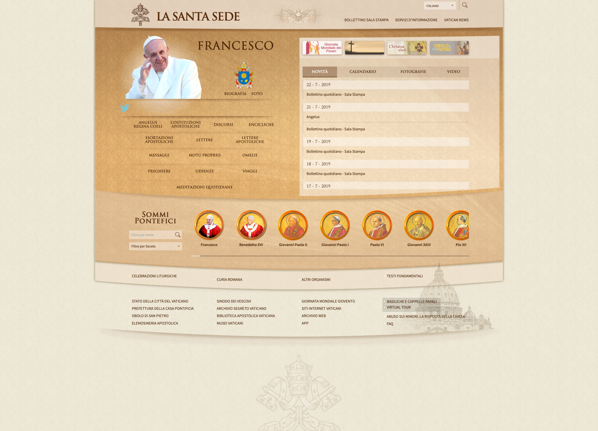
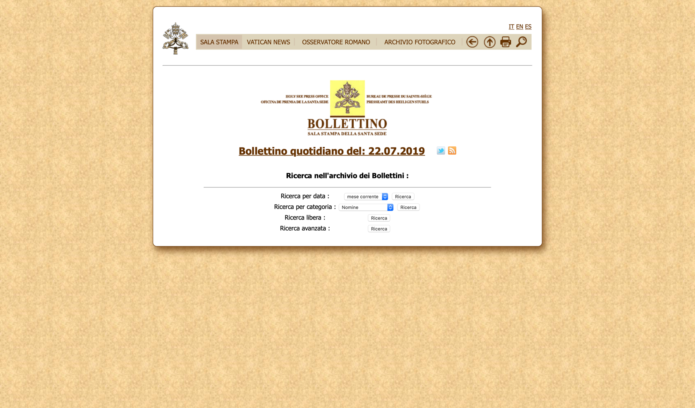
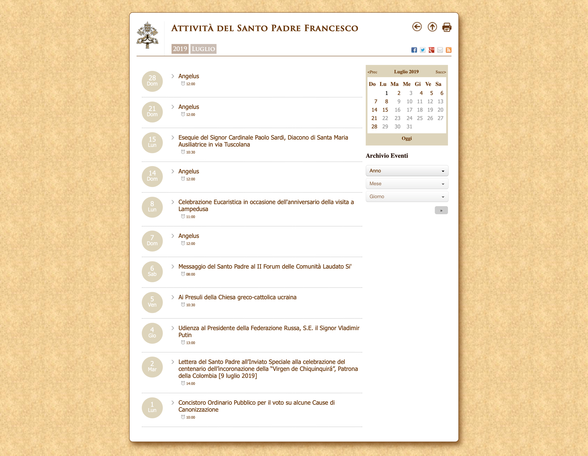

# Valutazione di conformità WCAG 2.1 del sito "vatican.va"

Valutazione di conformità rispetto alle linee guida WCAG 2.1, livello di conformità AA, del sito della Città del Vaticano "vatican.va".

 
[[Salta indice](#informazioni-generali)]

## Indice

[TOC]

## Informazioni generali

### Autori

- Enrico Basso
- Amos Cappellaro
- Luca Dal Poz

### Data di stesura del rapporto

Luglio 2019

## Metodo seguito

Il sito è stato inizialmente navigato per comprenderne la struttura e per individuare le pagine da utilizzare per l'analisi. Successivamente sono stati scelti degli strumenti aggiuntivi da utilizzare a supporto dell'analisi manuale delle pagine. Il lavoro vero e proprio di analisi è stato svolto leggendo ogni linea guida e verificando l'idoneità di ciascuna riportando man mano i risulati e le possibili soluzioni in caso di errore.

## Strumenti utilizzati

Le pagine sono state analizzate tramite tre PC portatili con le seguenti caratteristiche:

- PC 1:
    - Schermo LED da 15.6" (risoluzione 1366x768px)
    - Processore Intel Core i5 (2 GHz)
    - Memoria RAM 8GB
    - Sistema operativo Windows 10
    - Browser Mozilla Firefox
    - Mouse ottico con rotella collegato tramite USB
    - Tastiera italiana QWERTY
    - Connessione a rete Wi-Fi
- PC 2:
    - Schermo LED da 15.6" (risoluzione 1920x1080px)
    - Processore Intel Core i7 7700HQ (2.8 GHz)
    - Memoria RAM 16GB
    - Sistema operativo Windows 10 Home
    - Browser Google Chrome
    - Mouse ottico con rotella collegato tramite USB
    - Tastiera italiana QWERTY
    - Connessione a rete Wi-Fi
- PC 3:
    - Schermo LED da 13.3” (risoluzione 2560x1600px)
    - Processore Intel Core i5 (3,1 GHz)
    - Memoria RAM 8GB
    - Sistema operativo macOS Mojave (10.14.5)
    - Browser Google Chrome
    - Trackpad
    - Tastiera americana QWERTY
    - Connessione a rete Wi-Fi

Gli strumenti utilizzati per aiutarsi nell’analisi sono stati:

- WAVE: tool per controllare l’accessibilità delle pagine web (estensione per Google Chrome e Mozilla Firefox);
- Assistente vocale di Windows 10 "Narrator";
- Assistente vocale di macOS Mojave "Voice Over".

## Perimetro dell'indagine

Dopo un'attenta navigazione nel sito, al fine di analizzarne il modello concettuale, abbiamo concluso come più appropriate le pagine *Home*, *Bollettino* e *Calendario* da sottoporre al test di conformità WCAG 2.1. Non sottoponiamo al test, invece, altre pagine che - seppur rilevanti per l'utenza del sito in analisi - sono raggiungibili dal suddetto sito tramite link, ma appartenenti a siti esterni.  

Di seguito gli screenshot delle pagine (catturati il giorno 1 luglio 2019) sottoposte al test di conformità WCAG 2.1:  

- Pagina *Home*

- Pagina *Bollettino*

- Pagina *Calendario*

